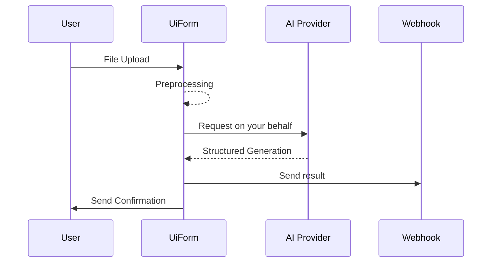

# UiForm

  *The AI Automation Platform*

Made with love by the team at [UiForm](https://uiform.com) 🤍.

[Our Website](https://uiform.com) | [Documentation](https://docs.uiform.com/get-started/introduction) | [Discord](https://discord.com/invite/vc5tWRPqag) | [Twitter](https://x.com/uiformAPI)

---

### How it works

UiForm solves all the major challenges in document processing with LLMs:

1. **Universal Document Processing**: Convert any file type (PDFs, Excel, emails, etc.) into LLM-ready format without writing custom parsers
2. **Structured, Schema-driven Extraction**: Get consistent, reliable outputs using schema-based prompt engineering
3. **Deployments**: Create custom mailboxes and links to process documents at scale
4. **Evaluations**: Evaluate the performance of models against annotated datasets
5. **Optimizations**: Identify the most used deployments and help you finetune models to reduce costs and improve performance

We are offering you all the software-defined primitives to build your own document processing solutions. We see it as **Stripe** for document processing.

Our goal is to make the process of analyzing documents and unstructured data as **easy** and **transparent** as possible.

Many people haven't yet realized how powerful LLMs have become at document processing tasks - we're here to help **unlock these capabilities**.

---

## How it works

UiForm allows you to easily create document processing deployments. Here is the general workflow:

---

## General philosophy

Our goal is to : 
<Steps>
  <Step title="Document Processing">
    Helping you leverage OpenAI API to do document processing tasks with structured generations
  </Step>
  <Step title="Deployment">
    Create custom mailboxes and links connected to your webhooks to process documents at scale
  </Step>
  <Step title="Optimization">
    Identify the most used deployments and help you finetune models to reduce costs and improve performance
  </Step>
</Steps>

---

We currently support [OpenAI](https://platform.openai.com/docs/overview), [Anthropic](https://www.anthropic.com/api), [Gemini](https://aistudio.google.com/) and [xAI](https://x.ai/api) models.

You come with your own API key from your favorite AI provider, and we handle the rest.

---

## Go further

- [Quickstart](/get-started/quickstart)
- [Prompt Engineering Guide](/get-started/prompting-with-the-JSON-schema)
- [General Concepts](/SDK/General-Concepts)
    - [Consensus](/SDK/General-Concepts#consensus)
- [Create mailboxes](/SDK/Deployments#mailbox)
- [Create links](/SDK/Deployments#link)
- Finetuning (coming soon)
- Prompt optimization (coming soon)
- Data-Labelling with our AI-powered annotator (coming soon)

---

## Jupyter Notebooks

You can view minimal notebooks that demonstrate how to use UiForm to process documents:
- [Mailbox creation quickstart](https://github.com/UiForm/uiform/blob/main/notebooks/mailboxes_quickstart.ipynb)
- [Upload Links creation quickstart](https://github.com/UiForm/uiform/blob/main/notebooks/links_quickstart.ipynb)
- [Document Extractions quickstart](https://github.com/UiForm/uiform/blob/main/notebooks/Quickstart.ipynb)
- [Document Extractions quickstart - Async](https://github.com/UiForm/uiform/blob/main/notebooks/Quickstart-Async.ipynb)

--- 

## Community

Let's create the future of document processing together!

Join our [discord community](https://discord.com/invite/vc5tWRPqag) to share tips, discuss best practices, and showcase what you build. Or just [tweet](https://x.com/uiformAPI) at us.

We can't wait to see how you'll use UiForm.

- [Discord](https://discord.com/invite/vc5tWRPqag)
- [Twitter](https://x.com/uiformAPI)

---

## Roadmap

We share our roadmap publicly on [Github](https://github.com/UiForm/uiform)

Among the features we're working on:

- [ ] Node.js SDK
- [ ] Finetuning
- [ ] Chat-based interface in the evaluation platform to rapidely generate visualizations
- [ ] Evals SDK
- [ ] Add more templates
