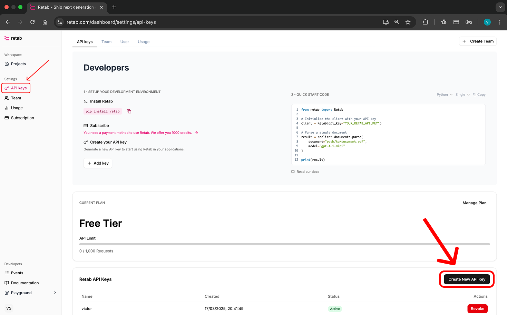

<div align="center" style="margin-bottom: 1em;">


# Retab

*The AI Automation Platform*

Made with love by the team at [Retab](https://retab.com) 🩷.

[Our Website](https://retab.com) | [Documentation](https://docs.retab.com/get-started/introduction) | [Discord](https://discord.com/invite/vc5tWRPqag) | [Twitter](https://x.com/retabdev)

</div>

---

### What is Retab?

[Retab](https://retab.com) is the complete developer platform and SDK for shipping state-of-the-art document processing in the age of LLMs. 

We want you to use Retab for a defined purpose: get **SHIP FAST** automations to get **STRUCTURED** & **QUALITY** data.

For this mission, we provide the best-in-class preprocessing, help you generate prompts & extraction schemas that fit your preferred model providers, iterate & evaluate the accuracy of your configuration, and ship fast your automation directly in your code.

### Why did we build Retab?

Because of **a new, lighter paradigm**

Large Language Models collapse entire layers of legacy OCR pipelines into a single, elegant abstraction. When a model can read, reason, and structure text natively, we no longer need brittle heuristics, handcrafted parsers, or heavyweight ETL jobs. Instead, we can expose a small, principled API: "give me the document, tell me the schema, and get back structured truth." Complexity evaporates, reliability rises, speed follows, and costs fall—because every component you remove is one that can no longer break. 

LLM‑first design lets us focus less on plumbing and more on the questions we actually want answered—Retab stands here. We help you **unlock these capabilities**, offering you all the software-defined primitives to build your own document processing solutions. We see it as **Stripe** for document processing.

Check our [documentation](https://docs.retab.com/overview/introduction).

Join our [Discord](https://discord.com/invite/vc5tWRPqag) and share your feedback.

---

## API Key

To use the API, you need to sign up on [Retab](https://www.retab.com/).

<p align="center">
  
</p>

---

## SDK

1. Install the SDK
```python
pip install retab
```

2. Generate a Schema
```python
from pathlib import Path
from retab import Retab
client = Retab(api_key="YOUR_RETAB_API_KEY")

response = client.schemas.generate(
    documents=["Invoice.pdf"],
    model="gpt-4.1",          # or any model your plan supports
    temperature=0.0,          # keep the generation deterministic
    modality="native",        # "native" = let the API decide best modality
)
```

3. Extract Data
```python
from pathlib import Path
from retab import Retab

from retab import Retab
client = Retab()

response = client.documents.extract(
    json_schema = "Invoice_schema.json",
    document = "Invoice.pdf",
    model="gpt-4.1-nano",
    temperature=0
)

print(response)
```

---

## Projects

On the [Platform](https://www.retab.com/), *Projects* provide a systematic way to test and validate your extraction schemas against known ground truth data. Think of it as evals for document AI. You can measure accuracy, compare different models, and optimize your extraction pipelines with confidence.

The project workflow for schema optimization:
1. Run initial project → identify low-accuracy fields
2. Refine descriptions and add reasoning prompts → re-run project
3. Compare accuracy improvements → iterate until satisfied
4. Deploy optimized schema to production

```python
from retab import Retab

client = Retab()

# Submit a single document
completion = client.deployments.extract(
    project_id="eval_***",
    iteration_id="base-configuration", # or the configuration that gave you the best precision score
    document="path/to/document.pdf"
)

print(completion)
```

Projects give you an easy-to-use automation engine that's easy to integrate in your codebase and workflows.

Check our [documentation](https://docs.retab.com/core-concepts/Projects).

---


## Community

Let's create the future of document processing together.

Join our [Discord](https://discord.com/invite/vc5tWRPqag) to share your journey, discuss best practices, and give your feedback. You can also follow us on [X (Twitter)](https://x.com/retabdev) at us.

We can't wait to see how you'll use Retab.

* [Discord](https://discord.com/invite/vc5tWRPqag)
* [Twitter](https://x.com/retabdev)

---

## Useful Links

* [x] **API**: [Documentation](https://docs.retab.com/api-reference/introduction)
* [x] **SDKs**: [Python & JavaScript SDK](https://docs.retab.com/overview/quickstart)

* [OpenAI](https://platform.openai.com/docs/guides/structured-outputs), [Google](https://ai.google.dev/gemini-api/docs/structured-output), [xAI](https://docs.x.ai/docs/guides/structured-outputs), [Outlines](https://dottxt-ai.github.io/outlines/latest/reference/generation/structured_generation_explanation/) on structured generation
* [Structured generation Starter Pack](https://github.com/retab-dev/structured-generation-starter-pack)
* [Quickstart](/get-started/quickstart)
* [API Reference](/api-reference/introduction)
* [Github Repository](https://github.com/retab-dev/retab)

---
## Roadmap

We share our roadmap publicly. Please submit your feature requests on [Github](https://github.com/retab-dev/retab)

Among the features we're working on:

* [ ] Schema optimization autopilot
* [ ] Sources API
* [ ] Document Edit API

