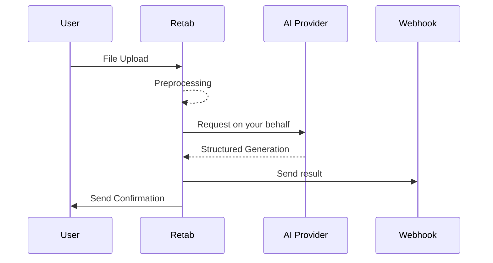

# Retab

<div align="center" style="margin-bottom: 1em;">


  *The AI Automation Platform*

Made with love by the team at [Retab](https://retab.dev) 🤍.

[Our Website](https://retab.dev) | [Documentation](https://docs.retab.dev/get-started/introduction) | [Discord](https://discord.com/invite/vc5tWRPqag) | [Twitter](https://x.com/retabAPI)


</div>

---

## How It Works

Retab allows you to easily create document processing automations. Here is the general workflow:



---

## General philosophy

Many people haven't yet realized how powerful LLMs have become at document processing tasks - **we're here to help you unlock these capabilities**.

Our mission can be described as follows:

- **Smarter Document Processing**
> Convert any file type (PDFs, Excel, emails, etc.) into LLM-ready format without touching any line of code.

- **Scalable Workflow Automation**
> Create custom automation loops to process documents at scale.

- **Model Efficiency & Cost Optimization**
> Get consistent, reliable outputs using schema-based prompt engineering to reduce costs and improve performance.

You come with your own API key from your favorite AI provider, and we handle the rest in an **easy** and **transparent** way.

We currently support [OpenAI](https://platform.openai.com/docs/overview), [Anthropic](https://www.anthropic.com/api), [Gemini](https://aistudio.google.com/prompts/new_chat) and [xAI](https://x.ai/api) models.

<p align="center">
  
</p>

---

## Quickstart

Explore our [Playground](https://www.retab.dev/dashboard/playground) and create your first automations easily 🚀!

<p align="center">
  
</p>

---

---

## Dev Mode 🔧

You need more control? You can access the [Documentation](https://docs.retab.dev/get-started/introduction) of our **Python SDK**.

1. **Setup the Python SDK**
> Install the Retab Python SDK and configure your API keys to start processing documents with your preferred AI provider.

2. **Create your JSON schema**
> Define the structure of the data you want to extract from your documents using our schema format with custom prompting capabilities.

3. **Create your FastAPI server with a webhook**
> Set up an endpoint that will receive the structured data extracted from your documents after processing.

4. **Create your automation**
> Configure an automation (mailbox or link) that will automatically process incoming documents using your schema and send results to your webhook.

5. **Test your automation**
> Validate your setup by sending test documents through your automation and verify the extracted data matches your requirements.

### Step 1: Setup of the Python SDK

To get started, install the `retab` package using pip:

```bash
pip install retab
```

Then, [create your API key on retab.dev](https://www.retab.dev).

Create another API key by you favorite API key provider. 

**Reminder**: We currently support [OpenAI](https://platform.openai.com/docs/overview), [Anthropic](https://www.anthropic.com/api), [Gemini](https://aistudio.google.com/prompts/new_chat) and [xAI](https://x.ai/api) models.

As we will use your API key to make requests to OpenAI on your behalf within an automation, you need to store your API key in the Retab secrets manager:

```
OPENAI_API_KEY=sk-xxxxxxxxx
RETAB_API_KEY=sk_retab_xxxxxxxxx
```

```bash
import retab
import os

reclient = retab.Retab()

reclient.secrets.external_api_keys.create(
    provider="OpenAI", 
    api_key=os.getenv("OPENAI_API_KEY")
)
```

#### Process your first document with the create_messages method:

```bash
from retab import Retab
from openai import OpenAI

# Initialize Retab client
reclient = Retab()

# Convert any document into LLM-ready format
doc_msg = reclient.documents.create_messages(
    document = "invoice.pdf"  # Works with PDFs, Excel, emails, etc.
)

client = OpenAI()
completion = client.chat.completions.create(
    model="gpt-4.1-nano",
    messages=doc_msg.openai_messages + [
        {
            "role": "user",
            "content": "Summarize the document"
        }
    ]
)
```

### Step 2: Create your JSON Schema

We use a standard JSON Schema with custom annotations (`X-SystemPrompt`, `X-FieldPrompt`, and `X-ReasoningPrompt`) as a prompt-engineering framework for the extraction process.

These annotations help guide the LLM’s behavior and improve extraction accuracy. 

You can learn more about these in our [JSON Schema documentation](https://docs.retab.dev/get-started/prompting-with-the-JSON-schema).

```bash
from retab import Retab
from openai import OpenAI
from pydantic import BaseModel, Field, ConfigDict

# Define your extraction schema
class Invoice(BaseModel):
    model_config = ConfigDict(
        json_schema_extra = {
            "X-SystemPrompt": "You are an expert at analyzing invoice documents."
        }
    )
    
    total_amount: float = Field(...,
        description="The total invoice amount",
        json_schema_extra={
            "X-FieldPrompt": "Find the final total amount including taxes"
        }
    )
    date: str = Field(...,
        description="Invoice date in YYYY-MM-DD format",
        json_schema_extra={
            "X-ReasoningPrompt": "Look for dates labeled as 'Invoice Date', 'Date', etc."
        }
    )

# Process document and extract data
reclient = Retab()
doc_msg = reclient.documents.create_messages(
    document = "invoice.pdf"
)
schema_obj = reclient.schemas.load(
    pydantic_model = Invoice
)

# Extract structured data with any LLM
client = OpenAI()
completion = client.beta.chat.completions.parse(
    model="gpt-4o",
    messages=schema_obj.openai_messages + doc_msg.openai_messages,
    response_format=schema_obj.inference_pydantic_model
)

print("Extracted data:", completion.choices[0].message.parsed)

# Validate the response against the original schema if you want to remove the reasoning fields
from retab._utils.json_schema import filter_auxiliary_fields_json
assert completion.choices[0].message.content is not None
extraction = schema_obj.pydantic_model.model_validate(
    filter_auxiliary_fields_json(completion.choices[0].message.content, schema_obj.pydantic_model)
)

print("Extracted data without the reasoning fields:", extraction)
```

### Step 3: Create your FastAPI server with a webhook

Next, set up a FastAPI route that will handle incoming webhook POST requests. 

Below is an example of a simple FastAPI application with a webhook endpoint:

```bash
from fastapi import FastAPI, Request
from fastapi.responses import JSONResponse
from retab.types.automations.webhooks import WebhookRequest
from pydantic import BaseModel, Field, ConfigDict

app = FastAPI()

@app.post("/webhook")
async def webhook(request: WebhookRequest):
    invoice_object = request.completion.choices[0].message.parsed # The parsed object is the same Invoice object as the one you defined in the Pydantic model
    print("Received payload:", invoice_object)
    return JSONResponse(content={"status": "success", "data": invoice_object})

# To run the FastAPI app locally, use the command:
# uvicorn your_module_name:app --reload
if __name__ == "__main__":
    import uvicorn
    uvicorn.run(app, host="0.0.0.0", port=8000)
```

You can test the webhook endpoint locally with a tool like curl or Postman - for example, using curl:

```bash
curl -X POST "http://localhost:8000/webhook" \
     -H "Content-Type: application/json" \
     -d '{"name": "Team Meeting", "date": "2023-12-31"}'
```

> ⚠️ **To continue**, you need to deploy your FastAPI app to a server to make your webhook endpoint publicly accessible.  
> We recommend using [Replit](https://replit.com) to get started quickly if you don’t have a server yet.

### Step 4: Create your automation

Finally, integrate the webhook with your automation system using the `retab` client. 

This example demonstrates how to create an automation that triggers the webhook when a matching event occurs:

```bash
from retab import Retab

# Initialize the Retab client
reclient = Retab()

# Create an automation that uses the webhook URL from Step 2
automation = reclient.processors.automations.mailboxes.create(
    email="invoices@mailbox.retab.dev",
    model="gpt-4.1-nano",
    json_schema=Invoice.model_json_schema(), # use the pydantic model to create the json schema
    webhook_url="https://your-server.com/webhook",  # Replace with your actual webhook URL
)
```

At any email sent to `invoices@mailbox.retab.dev`, the automation will send a POST request to your FastAPI webhook endpoint, where the payload can be processed.

You can see the automation you just created on your [dashboard](https://www.retab.dev/dashboard/processors)!

### Step 5: Test your automation

Finally, you can test the automation rapidly with the test functions of the sdk:

```bash
from retab import Retab

# Initialize the Retab client
reclient = Retab()

# If you just want to send a test request to your webhook
log = reclient.processors.automations.mailboxes.tests.webhook(
    email="test-mailbox-local@devmail.retab.dev", 
)

# If you want to test the file processing logic: 
log = reclient.processors.automations.mailboxes.tests.process(
    email="test-mailbox-local@devmail.retab.dev", 
    document="your_invoice_email.eml"
)

# If you want to test a full email forwarding
log = reclient.processors.automations.mailboxes.tests.forward(
    email="retab-quickstart@mailbox.retab.dev", 
    document="your_invoice_email.eml"
)
```

> 💡 **Tip:** You can also test your webhook locally by overriding the webhook URL set in the automation.

```bash
from retab import Retab

reclient = Retab()

# If you just want to send a test request to your webhook
log = reclient.processors.automations.mailboxes.tests.webhook(
    email="test-mailbox-local@devmail.retab.dev", 
    webhook_url="http://localhost:8000/webhook" # If you want to try your webhook locally, you can override the webhook url set in the automation
)
```

And that's it! You can start processing documents at scale! 
You have 1000 free requests to get started, and you can [subscribe](https://www.retab.dev) to the pro plan to get more.

But this minimalistic example is just the beginning. 

Continue reading to learn more about how to use Retab **to its full potential** 🔥.

---

## Go further

- [Prompt Engineering Guide](https://docs.retab.dev/get-started/prompting-with-the-json-schema)
- [General Concepts](https://docs.retab.dev/get-started/General-Concepts)
    - [Consensus](https://docs.retab.dev/SDK/General-Concepts#consensus)
- [Create mailboxes](https://docs.retab.dev/SDK/Automations#mailbox)
- [Create links](https://docs.retab.dev/SDK/Automations#link)
- Finetuning (coming soon)
- Prompt optimization (coming soon)
- Data-Labelling with our AI-powered annotator (coming soon)

---

## Jupyter Notebooks

You can view minimal notebooks that demonstrate how to use Retab to process documents:

- [Mailbox creation quickstart](https://github.com/Retab-dev/retab/blob/main/notebooks/mailboxes_quickstart.ipynb)
- [Upload Links creation quickstart](https://github.com/Retab-dev/retab/blob/main/notebooks/links_quickstart.ipynb)
- [Document Extractions quickstart](https://github.com/Retab-dev/retab/blob/main/notebooks/Quickstart.ipynb)
- [Document Extractions quickstart - Async](https://github.com/Retab-dev/retab/blob/main/notebooks/Quickstart-Async.ipynb)

--- 

## Community

Let's create the future of document processing together!

Join our [discord community](https://discord.com/invite/vc5tWRPqag) to share tips, discuss best practices, and showcase what you build. Or just [tweet](https://x.com/retabAPI) at us.

We can't wait to see how you'll use Retab.

- [Discord](https://discord.com/invite/vc5tWRPqag)
- [Twitter](https://x.com/retabAPI)


## Roadmap

We publicly share our Roadmap with the community. 

Please open an issue or [contact us on X](https://x.com/sachaicb) if you have suggestions or ideas.

- [ ] node client with ZOD
- [ ] Make a json-schema zoo
- [ ] Offer tools to display tokens usage to our users
- [ ] Launch the data-labelling API (Dataset Upload / Creation / Management / Labelling / Distillation)
- [ ] Launch the data-labelling platform: A web app based on the data-labelling API with a nice UI
- [ ] Launch the prompt-optimisation sdk
- [ ] Launch the finetuning sdk 
